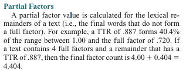
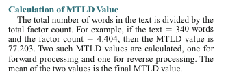

# Complexity of German Texts Written by Primary School Children - Paper Notes

## Data
* Longitudinal study - 10 test points (TP1 - TP10) for each participant

## Methods

### Lexical Diversity
*Lemmatize tokens, exclude tokens with non-alphabetic characters*

<ins>**Question for testing**: Should I include such tokens in the generated text, to test that function? Or possibly have a separate test for it?</ins>

#### MATTR (Moving Average Type-Token Ratio)

1. Choose window size: $W = 15$
2. Calculate TTR for current window
3. Shift window to the right by 1 token
4. End when less than $W$ tokens are left (?)
5. Calulate mean of all TTRs

------------------------------
For each window $W_i$

$TTR(W_i) = \dfrac{|V_{W_i}|}{N_{W_i}}$

$N $ - Text Length $(N_{W_i} = W)$; $|V|$ - vocabulary size

-----------------------------
**Test idea**: Generate text out of a defined vocabulary $V = \{a, b\}$ with length $N = 16$. Increase add $\{c\}$ to the vocabulary and generate a new sentence with the same length. Expect $Result_1 < Result_2$. Maybe increase $N$ as well and expect that the longer text with same amount of token-types results in lower scores.

<ins>*Alternatively:* Calculate the MATTR scores myself while generating and compare with the script results. But who tests if I did it right, then?</ins>

#### MTLD (Measure of Textual Lexical Diversity)
1. Define a TTR threshold: &nbsp; $TTR_{max} = 0.72$ **(is that the case in this paper?)**
2. Start sequence at first token and calculate $TTR_{i}$ **for the sequence** $i$ (should be 1)
3. Extend the sequence until $TTR_i < TTR_{max}$
4. Start new sequence
5. Repeat until EOT
6. *conditional:* If last window doesn't reach threshold - calculate proportional value $TTR_{prop}$ **(*)**
7. Final score = $i_{max} + TTR_{prop}$
8. Repeat in the other direction (last to first token).
9. Calculate mean of the two scores

\* Partial factors:\

*tl;dr: The more unique tokens in the sentence, the lower the score? This does not take the text length into consideration? (You could have a text of 1 unique token with a lesser result than a text with 20 tokens and 19 unique.)*

<ins>**NOTE: The described calculation deviates from the original paper (and thus causes the scenario above). Is this on purpose?**</ins>

**Test idea**: If the method from the original paper is used - Generate a text from a vocabulary $V_1 = \{a, b\}$, then generate a text from vocabulary $V_2 = \{a, b, c, d\}$ and expect that $MTLD_{V_1} < MTLD_{V_2}$. 

<ins>Do this multiple times to make sure? What sentence lenghts (and vocabulary size) should I use (>100 tokens, presumably)?</ins>

**Further question:** MTLD Paper suggest that this metric is not useful for texts with less than 100 tokens (they frequently contain only the partial factor). In this paper it's stated, that there are very short texts in the Litkey corpus. Why is this metric used nevertheless?

#### HD-D (Hypergeometric Distribution D)

1. For each type $t$ in $V$ calculate the probability $HD_t$ of finding it in a random sample (uning the Hypergeometric Distribution).
2. Calculate the HD-D index: $\displaystyle\sum\limits_t^{|V|}HD_t$

<ins>**Question:** *The paper assumes an increase in HDD is equal to an increase in complexity. But should't it be the opposite? Shouldn't lower type probabilities mean a larger diversity (because there are little tokens per type)?*</ins>

**Test idea:** Gradually increase vocabulary and expect that HD-D also increases.

#### TF-IDF-LDist 

0. For each TP ($TP_i$)
1. Calculate binary $tf$ for every word $w$

$tf(w) = \begin{cases} 
      0 & w\notin V_{TP_i} \\
      1 & w\in V_{TP_i}
   \end{cases}
$

2. Calculate tf-idf

$tf$-$idf(w) =tf(w) * \dfrac{N}{df_t}$

$N -$ number of texts (in this TP?)\
$df_t -$ total number of texts in which word occurs (in this TP?)

3. Average all tf-idf values for the current TP

4. Per Text: Count how many words are above the current mean and normalize by the text length.

**Test idea:** Generate multiple texts (simulating a TP) with a vocabulary $V = \{a, b\}$, then generate a single text with an extended vocabulary $V = \{a, b, c, d\}$ and expect it to have a higher score.

### Syntactic Complexity

#### Top POS n-grams

*Is there something to test here?*

**Test idea (if needed):** *Define two vocabularies. The fist one consists only of NN und NE words, and the second one of NN,NE and VVFIN words.*

#### Perplexity
