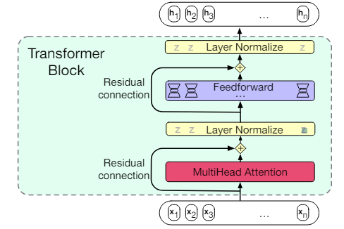
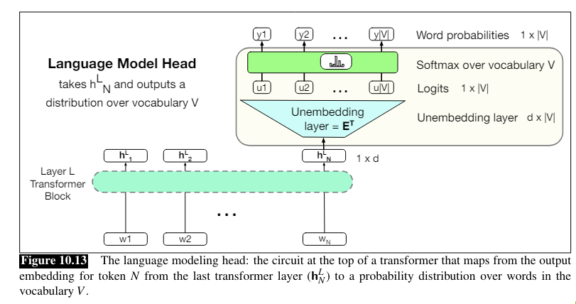
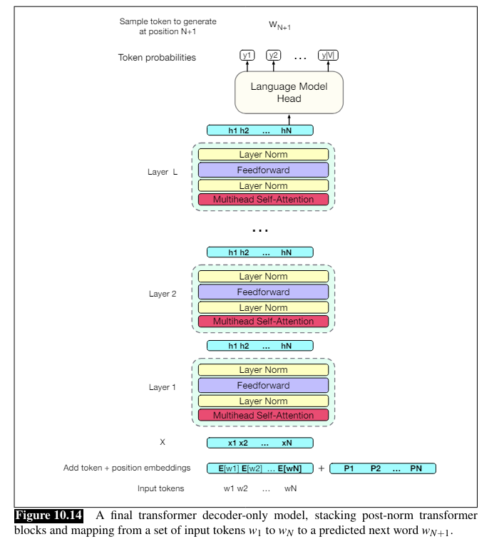

# Transformer Models

## The Transformer Model
* The standard architecture of building a Large Language Model (LLM)

### Self-Attention
A mechanism to look broadly at the context in order to build representations for the words in layer *k*, in the form of a weight distribution vector $\alpha$ for words in layer *k-1*

#### Casual / Backward-looking self-attention

* Context includes only prior words

##### Formal definition (Version 1):
$score(\mathbf{x}_{i}, \mathbf{x}_{j}) = \mathbf{x}_{i} \cdot \mathbf{x}_{j}$ - results in a scalar (larger value = more similar vectors)\
$\alpha_{ij} = softmax(score(\mathbf{x}_{i}, \mathbf{x}_{j}))\ \forall j\le i$\
$\mathbf{a}_i = \displaystyle\sum\limits_{j\le i}\alpha_{ij}\mathbf{x}_j$

##### Input embedding roles:
**query** - as the current focus of attention\
$\mathbf{q}_i = \mathbf{x}_i\mathbf{W^Q}$

**key** - as a preceding input compared to the current query\
$\mathbf{k}_i = \mathbf{x}_i\mathbf{W^K}$

**value** - as a value used to compute the output for the current query\
$\mathbf{v}_i = \mathbf{x}_i\mathbf{W^V}$

##### Formal definition (Version 2):
$score(\mathbf{x}_{i}, \mathbf{x}_{j}) = \mathbf{q}_{i} \cdot \mathbf{k}_{j}$\
$\alpha_{ij} = softmax(score(\mathbf{x}_{i}, \mathbf{x}_{j}))\ \forall j\le i$\
$\mathbf{a}_i = \displaystyle\sum\limits_{j\le i}\alpha_{ij}\mathbf{v}_j$

##### Final version:
*Result of the dot product in v2 can be arbitrarily large/small, which leads to problems in exponentiation, thus it needs to be normalized (divided by $\sqrt{d_k}$- the root of the dimensionality of the key and query vectors).*

$score(\mathbf{x}_{i}, \mathbf{x}_{j}) = \dfrac{\mathbf{q}_{i} \cdot \mathbf{k}_{j}}{\sqrt{d_k}}$\
$\alpha_{ij} = softmax(score(\mathbf{x}_{i}, \mathbf{x}_{j}))\ \forall j\le i$\
$\mathbf{a}_i = \displaystyle\sum\limits_{j\le i}\alpha_{ij}\mathbf{v}_j$

### Parallelized self-attention
*In order to make the prevoiusly described self-attention algorithm more effective, we can compute all elements in parallel, using matrices*

**Query matrix**: 
$\mathbf{Q} = \mathbf{X}\mathbf{W^Q}$

**Key matrix**: $\mathbf{K} = \mathbf{X}\mathbf{W^K}$

**Value matrix**: $\mathbf{V} = \mathbf{X}\mathbf{W^V}$

**Result matrix**: **A** (dim: $N\times d$ )\
$\mathbf{A}=SelfAttention(\mathbf{Q, K, V}) = softmax(\dfrac{\mathbf{QK}^T}{\sqrt{d_k}})\mathbf{V}$

#### Masking out the future
*The computation of $\mathbf{QK}^T$ is done for all queries for every key - including the future ones, which is not useful in the context of language modelling (since we shouldn't have knowledge about following words)*

**How to fix it?**\
We can set all values lying above the main diagonal to $-\infin$, which means we satisfy the $\forall j\le i$ condition

### Multihead Attention
*In order to be able to handle multiple relations of a single word, we can define multiple heads ($i$), each of which has its own set of weight matrices*

**Query matrix**: 
$\mathbf{Q} = \mathbf{X}\mathbf{W^Q_i}$

**Key matrix**: $\mathbf{K} = \mathbf{X}\mathbf{W^K_i}$

**Value matrix**: $\mathbf{V} = \mathbf{X}\mathbf{W^V_i}$

$\mathbf{head}_i = SelfAttention(\mathbf{Q, K, V}) = softmax(\dfrac{\mathbf{QK}^T}{\sqrt{d_k}})\mathbf{V}$

**Result matrix**:\
$\mathbf{A} = MultiHeadAttention(\mathbf{X}) = (\mathbf{head}_1 \oplus \mathbf{head}_2 ... \oplus \mathbf{head}_h)\mathbf{W}^O$

## Transformer Blocks
*Transformer blocks are build from the following elements:*
1. Self-Attention Layer
2. Feedforward Layer
3. Residual Connections
4. Normalizing Layers ("layer norm")

### Feedforward layer
*Contains $N$(number of tokens) networks. Each network has 2 layers (1 hidden + output with 2 weight matrices). They are independent for each position and can be computed in parallel. The dimensions of the hidden layer can be higher than the dimensions of the model*

### Residual connections
*Connections, that pass information from a lower to a higher layer, withough going through the intermediate layer. It gives higher layers access to unmodified information from lower layers and improves learning. Implementation: simply adding the unmodified vector to the layer output*

### Layer Normalization
*Variation of a z-score*

**1. Calculate mean $\mu$**\
$\mu = \dfrac{1}{d_h}\displaystyle\sum\limits_{i=1}^{d_h}x_i$

**2. Calculate standard deviation $\sigma$**\
$\sigma = \displaystyle\sqrt{\dfrac{1}{d_h}\displaystyle\sum\limits_{i=1}^{d_h}(x_i-\mu)^2}$

**3. Normalize the vector components**\
$\mathbf{\hat{\mathbf{x}}}=\dfrac{(\mathbf{x}-\mu)}{\sigma}$

**4. Implement layer norm, using gain ($\gamma$) and offset($\beta$)**\
LayerNorm $\ =\ \displaystyle\gamma\ \mathbf{\hat{x}}\ +\ \beta$

### Whole transformer block

$\mathbf{O}$ = LayerNorm ($\mathbf{X}$ + SelfAttention($\mathbf{X}$))\
$\mathbf{H}$ = LayerNorm ($\mathbf{O}$ + FFN($\mathbf{O}$))

*or described with one equation for each component:*

$\mathbf{T}^1$ = SelfAttention (**X**)\
$\mathbf{T}^2$ = $\mathbf{X}$ + $\mathbf{T}^1$\
$\mathbf{T}^3$ = LayerNorm ($\mathbf{T}^2$)\
$\mathbf{T}^4$ = FFN ($\mathbf{T}^3$)\
$\mathbf{T}^5$ = $\mathbf{T}^4 + \mathbf{T}^3$\
$\mathbf{H}$ = LayerNorm ($\mathbf{T}^5$)

***Both the input and output vectors (X and O) are of shape $[N\times d]$***

#### Pre-norm vs. post-norm architecture
*Prenorm transformers are similar to the above, but the layer norm is before the attention layer and before the feedforward layer, instead of after. Additionaly there is a last normallization for the last $\mathbf{h}_i$ of each token stream.*

### The inputs: embeddings
1. Token embedding
2. Position embedding
3. Add them up
4. ???
5. Profit

## The Language Modeling Head

**Unembedding layer:** *Project the output $(h_n^L)$ to the logit vector (score vector $[1\times V]$). It uses the Transpose of the Embedding Matrix.*

**Softmax:** *Turns the logits into probabilities over the Vocabulary*

**Logit lens:** *We can get the output from single layers and pretend it's the last one. The resulting logits can be useful for tracking how the model works.*

----------------------
**Decoder-only model:** The model shown in 10.14 is a one-way language model - roughly the half of an encoder-decoder model.

---------------------------

## LLMs with Transformers
#### Greedy decoding
*Always chooses the most likely word in a given context. This leads to generic and repetative texts.*

#### Random sampling
*Picks a random word, that has a probability to appear after current token. Although it sometimes works, many low-probability words get chosen, leading to weird sentences.*

#### Top-k sampling
*Picks a random word from the top k most probable choices. When k=1, it's equivalent to greedy decoding.*

#### Nucleus / Top-p sampling
*Keeps the top p-percent of the probability mass (instead of a constant k). Should work better in different contexts.*

#### Temperature sampling
*Divides the whole logit by a parameter $\tau$. If close to 1, the logit scores don't change much. The further it is, the larger the scores become. Since softmax pushes high values towards 1 and low values towards 0, this makes the distribution more greedy. Low temperature sampling ($\tau \in (0; 1]$) exacerbates outliers. High temperature sampling ($\tau > 1$) flattens the distribution.*

## LLMs: Training Transformers

### Self-supervised training algorithm
*We give the model the a token from a text and ask it to predict the next word(s). We measure the loss by comparing it to the real sequence.*

