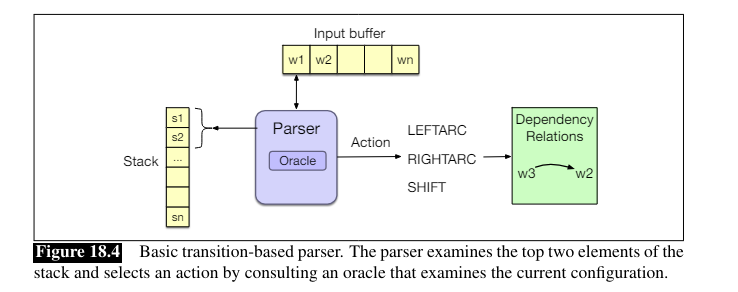
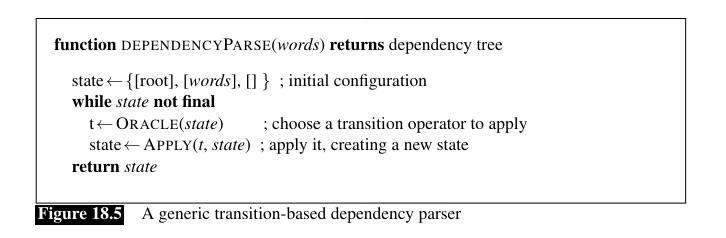
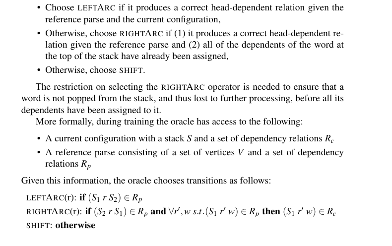
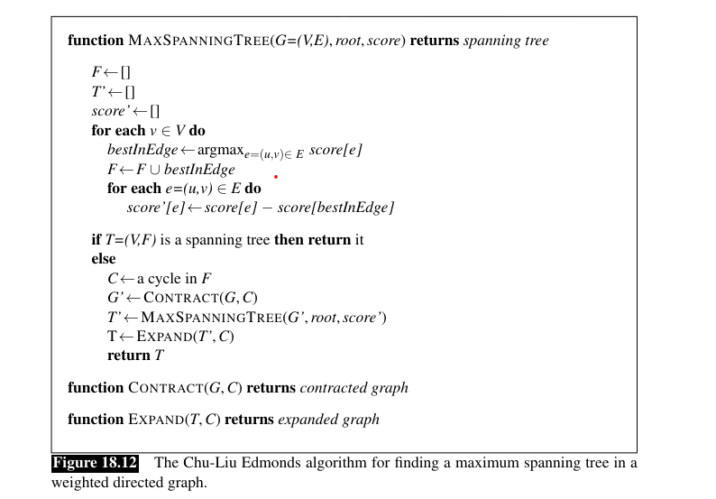
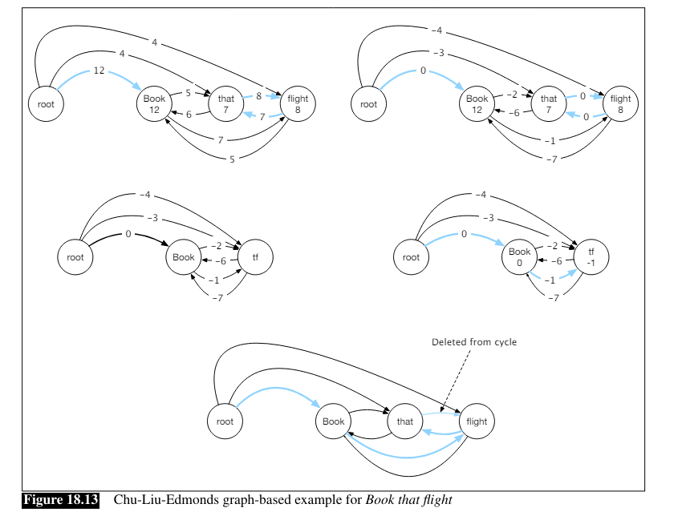

# Dependency Parsing
* root node alwaus exists
* **typed dependency structure** - relations are labeled with names from a fixed inventory
* free word order \
***Question:*** Does this mean that parses can't get broken by scrambling around the constituents?

## Dependency Relations
Traditional **grammatical relation** - **head** (central organizing word) and **dependent** (modifier) 

### Dependency Formalisms
$G = (V,A)$\
$G $ - directed graph\
$V $ - set of vertices\
$A $ - set of ordered pairs of vertices (arcs)

**Dependency Tree** - directed graph (G) that satisfies:
1. Single designated root node with no incoming arcs
2. With the exception of the root, each vertex has exactly one incoming arc
3. There is a unique path from the root node to each vertex in V

### Projectivity
An arc ist **projective** if there is a (dependency) path from the head to **every word** that (in the sentence) lies between it and the dependent.

### Dependency Treebanks
https://universaldependencies.org/

## Transition-Based Dependency Parsing

**state** - consists of *the stack* (starting with 'root' inside **(why?)**), *the input buffer*, and *the set of relations*

**t** - a transition chosen by the Oracle. Can be one of three:
1. LeftArc - Head is top stack word, dep is second stack word; Remove second word from stack 
2. RightArc - Head is second stack word, dep is first stack word; remove top word from stack
3. Shift - Remove word from buffer and push it onto the stack

**final state** - when there are no words left in the stack

**Question (figure 18.6):** Why doesnt the root->book relation get directly assigned in step 1? - Answer cause Oracle says so (see above Fig. 18.9)

### Creating an Oracle
* Supervised machine learning training

### Feature-based classifier
I don't really get that

### A neural classifier

Take first buffer word, top 2 words from stack, an encoding of the whole sentence -> put through a FFN and softmax() = magic

### Advanced Methods in Transition-Based Parsing

**Arc-Eager System**: Works with top of stack and first in buffer as inputs. Allows for words to be assigned as dependent without removing them. Adds a *reduce* operator to handle removal.

**Beam Search**: Explores alternative decision sequences (within a fixed beam width).

## Graph-Based Dependency Parsing
More accurate than transition-based

Go thorugh all possible seqences in a tree, to maximize a certain score. The overall score for a tree is equal to the sum of all edge-scores in the tree (**edge-factored**).

### Parsing via finding the maximul spanning tree

**spanning tree** - a tree that covers all vertices in G; must start at ROOT

**maximum spannin tree** - spanning tree with the best score

**Algorithm**:

1. For each vertex in the graph:
    1. Choose edge with the highest score
    2. If the resulting set of edges is a **spanning tree** (no cycles, each vertex has one incoming edge), return it

2. If we dont: do a cleanup.
    1. Adjust the graph weights by substracting the score of the maximum edge entering each vertex (results in a 0 weight for all the edges involved in the greedy selection)
    2. Colapse the cycling nodes into a single one
    3. Apply the algorithm to the new graph recursively
    4. Expand the combined node and eliminate the cycle (**Question: how does that work exactly?**)

### Feature based algorithm for assigning scores

1. Extract a set of features
2. Parse a sentence from the training set with random weights
3. For incorrect parses: Lower weights for features, not present in the gold parse 
4. Wait for the weights to converge

### A neural algorithm for assigning scores

## Evaluation
* LAS - Labeled attachment score
* UAS - Unlabled attachment score